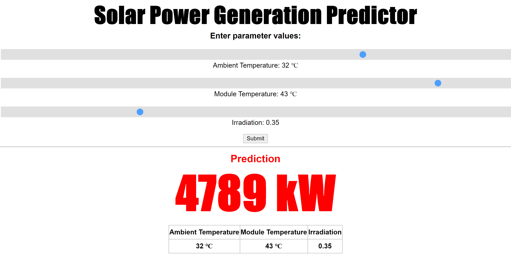

# DC Solar Power Generation Predictor
 
This is a full-stack webapp project the predicts the amount of solar power generated at the power plant in environmental conditions specified by the user.

The finished webapp is hosted on Heroku and can be accessed by the following link:
https://dcsolarpowergeneration.herokuapp.com/

This model uses data collected at a solar power plant in India to make predictions based on a linear regression. Technologies used include: Python, pandas, scikit-learn, flask, PostgreSQL, psycopg2, HTML, and Heroku

The model is also accessible by an api at https://dcsolarpowergeneration.herokuapp.com/predict_api
with required parameters ambient, module, and irradiation.
